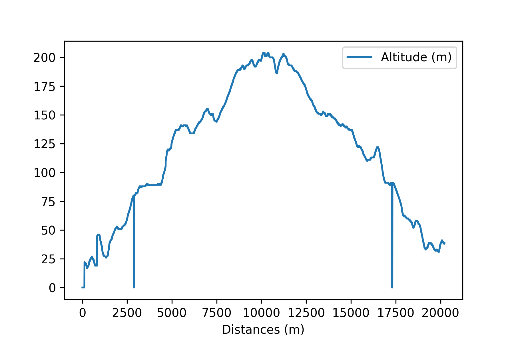
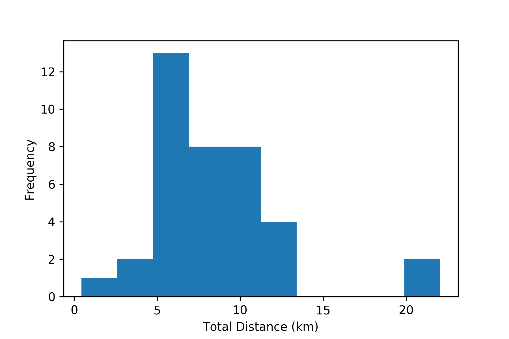

# Running Training Sessions Data Set

This data set contains logged training sessions of a hobby
athlete. Each session is logged at a resolution of one second,
containing

* Time
* Heart Rate (bpm)
* Speed (km/h)
* Pace (min/km)
* Cadence (steps/minute)
* Altitude (m)
* Distance (m)

The device used to log the runs (the discontinued Polar M400 running
watch) also creates columns for additional metrics that it doesn't
log. These are left blank in the files. The data is provided as
gzipped CSV files. *Note that no data cleaning was attempted*. This
means that the data contains outliers and measurement errors. Below
you see a sample plot representing the altitude profile of 20
kilometers run, including a number of apparent measurement errors.

The data set contains sessions of various distances ranging from a few
kilometers to 20+ kilometers.

